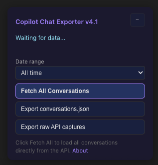

# M365 Copilot Chat Exporter

Export Microsoft 365 Copilot conversations as ChatGPT-compatible `conversations.json`.

A Tampermonkey userscript that bulk-exports your Copilot Chat history from [m365.cloud.microsoft/chat](https://m365.cloud.microsoft/chat) into the same JSON format as a ChatGPT data export, so it works with any tool that reads ChatGPT exports.

## Features

- **Fetch All** — bulk-fetches every Copilot conversation via the Substrate API (paginated, handles hundreds of chats)
- **ChatGPT-compatible export** — outputs `conversations.json` in the same format as a ChatGPT data export
- **Date range filter** — filter by Today, Last 7 days, Last 30 days, Last year, or a custom date range before fetching/exporting
- **Raw API export** — optionally export the raw Substrate API responses for debugging or custom processing
- **Passive capture** — also captures conversations as you browse them normally, no fetch required
- **No external dependencies** — single self-contained userscript, no build step, no server

## How it works

The script reads your existing MSAL authentication token from the browser's `localStorage` (the same token Microsoft 365 already has) and calls the Substrate API endpoints that the Copilot Chat UI itself uses. No additional login or Azure AD app registration is required.

## Installation

1. Install [Tampermonkey](https://www.tampermonkey.net/) (or a compatible userscript manager)
2. Install the script from [Greasy Fork](https://greasyfork.org/) or create a new userscript and paste the contents of `copilot_chat_capture.user.js`

## Usage

1. Navigate to [m365.cloud.microsoft/chat](https://m365.cloud.microsoft/chat)
2. A floating panel appears in the bottom-right corner
3. (Optional) Select a date range to limit which conversations are fetched
4. Click **Fetch All Conversations** — the script paginates through your chat list and fetches each conversation's content
5. Click **Export conversations.json** to download

## Limitations

- The Substrate API returns at most ~500 recent conversations via the `GetChats` pagination endpoint
- Requires an active Microsoft 365 Copilot session (the script reuses your existing browser auth)
- If your MSAL token expires mid-fetch, refresh the page and try again

## Acknowledgements

Hat tip to [M365 Copilot Exporter](https://greasyfork.org/en/scripts/543763-m365-copilot-exporter) by ganyuke — the MSAL token decryption approach and Substrate API request format were adapted from that project. This script differs by outputting ChatGPT-compatible `conversations.json` (instead of raw per-conversation JSON files), adding date range filtering, and running as a single zero-dependency userscript.

## Screenshot

Below is a screenshot of the floating panel added by the script:

